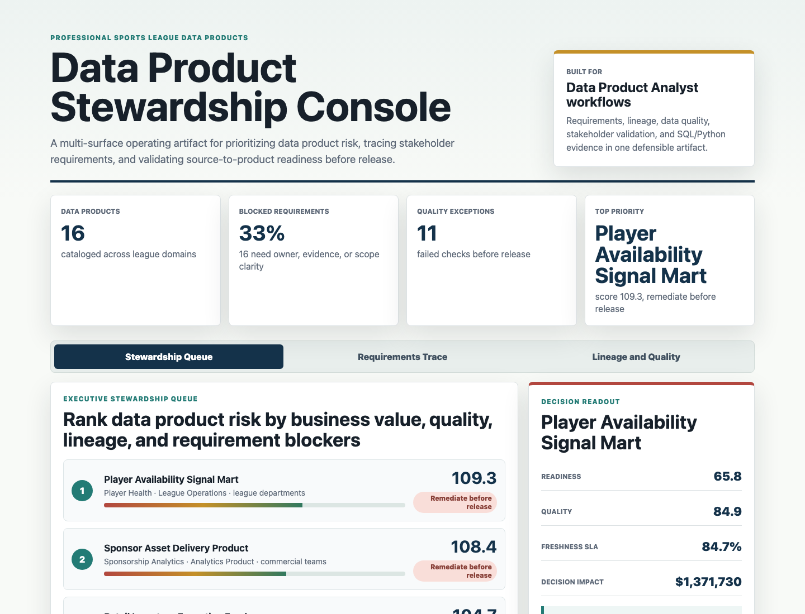
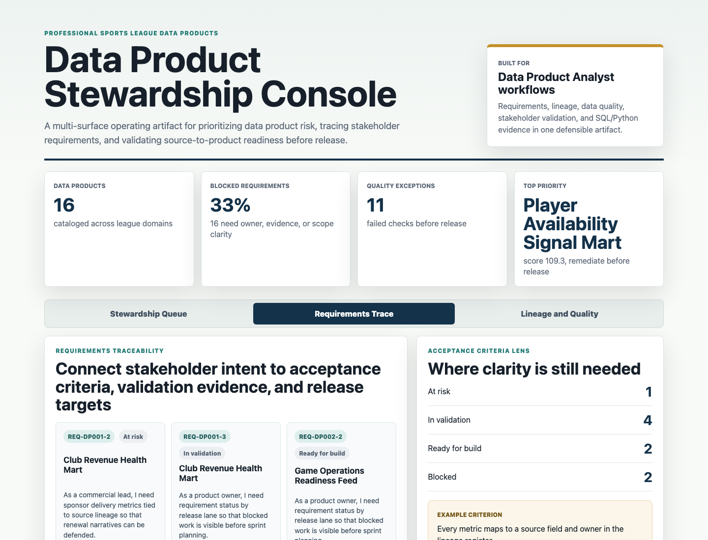
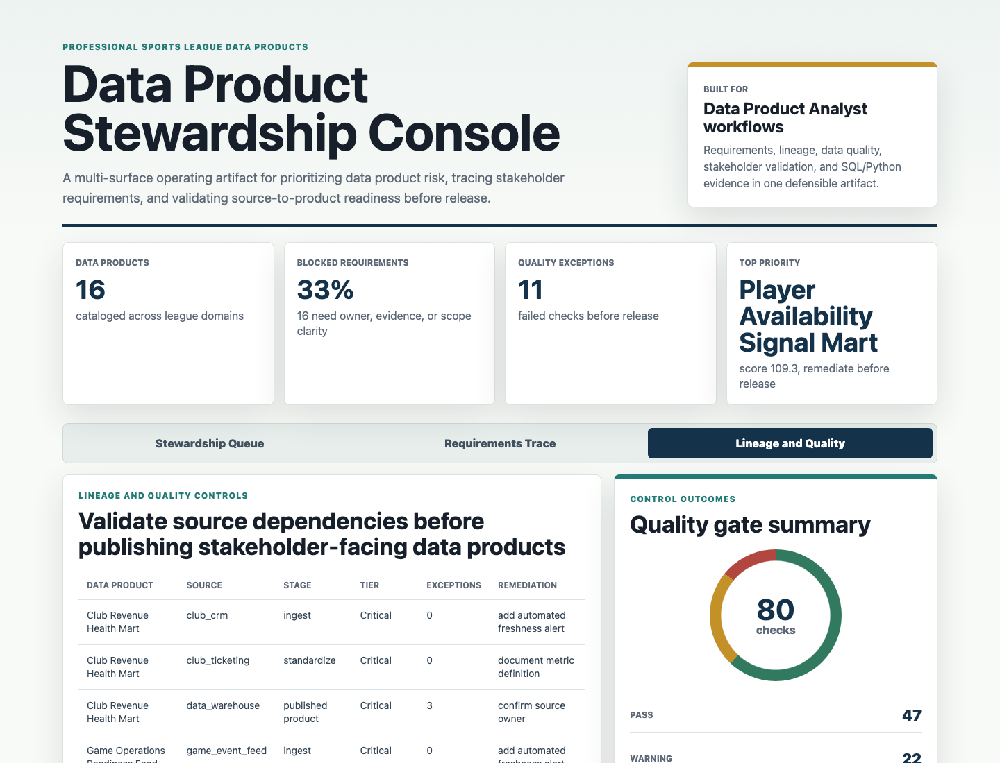

# Data Product Stewardship Console

A portfolio artifact for a Data Product Analyst role in a professional sports league environment. The project turns ambiguous stakeholder requests, source reliability issues, lineage dependencies, and quality checks into a release-readiness operating console.

The artifact is intentionally more than a dashboard. It shows how a product analyst can translate business needs into traceable requirements, validate data quality, prioritize remediation, and communicate release risk to technical and non-technical stakeholders.

## Screenshots



**Stewardship queue:** ranks sports league data products by priority score, readiness, quality, freshness, requirement blockers, lineage dependencies, and estimated decision impact.



**Requirements traceability workbench:** connects stakeholder groups, user stories, acceptance criteria, linked quality checks, validation status, and release targets.



**Lineage and quality controls:** maps source systems to product stages, quality exceptions, dependency tiers, owners, and remediation actions.

## What This Demonstrates

- Requirements elicitation translated into user stories, acceptance criteria, validation states, and release targets.
- Data stewardship practices across quality, lineage, metadata ownership, remediation, and responsible publication.
- SQL and Python evidence for prioritizing high-risk data products.
- Business-friendly communication for clubs, league departments, football staff, media teams, and commercial stakeholders.
- Prioritization based on business value, complexity, impact, risk, and readiness.

## Artifact Surfaces

1. **Executive stewardship queue:** shows which data products should be released, validated, or remediated before stakeholder publication.
2. **Requirements traceability:** shows how intake moves through user story definition, acceptance criteria, quality evidence, and validation.
3. **Lineage and quality controls:** shows source dependencies, control outcomes, failed checks, and remediation ownership.
4. **Evidence layer:** includes generated CSV outputs, SQL checks, Python scoring logic, and written findings.

## Data

All data in this repository is synthetic and labeled as synthetic. It does not represent real league, club, fan, player, or commercial performance.

The synthetic data is modeled on common professional sports league data product structures:

- 16 data products spanning club reporting, football operations, fan engagement, media insights, sponsorship analytics, ticketing, player health, and consumer products.
- 32-club style operating assumptions, reflected through club reporting and stakeholder groups.
- Source-to-product lineage across ingest, standardization, semantic model, and published product stages.
- Cloud data platform workflow assumptions using landing, validation, warehouse model, and product API stages.
- Daily operating metrics over 120 days for quality score, freshness SLA, stakeholder adoption, requirement coverage, incident count, and business value index.
- Requirements with user stories, acceptance criteria, quality checks, validation state, and release target.
- Quality checks for freshness, completeness, schema drift, key uniqueness, and lineage ownership.

Generated datasets:

| File | Grain | Purpose |
|---|---:|---|
| `data/entities.csv` | data product | Product catalog, domain, owner, consumer group, criticality, platform stage |
| `data/daily_metrics.csv` | product by day | Quality, freshness, adoption, coverage, incidents, value |
| `data/source_events.csv` | event | Escalations, source exceptions, definition mismatches, late feeds |
| `data/requirements_traceability.csv` | requirement | User stories, acceptance criteria, status, validation, release target |
| `data/lineage_map.csv` | product dependency | Source system, pipeline stage, dependency tier, owner, remediation |
| `data/quality_checks.csv` | control check | Thresholds, observed values, pass-warning-fail results |
| `data/recommended_actions.csv` | action | Remediation actions, expected quality lift, effort, status |

Analysis outputs:

| File | Purpose |
|---|---|
| `analysis/outputs/priority_queue.csv` | Ranked data product release and remediation queue |
| `analysis/outputs/requirements_traceability.csv` | Stakeholder requirement evidence layer |
| `analysis/outputs/lineage_quality_risks.csv` | Source dependency and quality exception map |
| `analysis/outputs/portfolio_summary.json` | Summary metrics used by the UI |

## Scoring Method

The Python scoring model is deliberately transparent. It combines:

- Product criticality.
- Quality gap from a 96 percent readiness target.
- Freshness gap from a 95 percent SLA target.
- Open requirement blockers.
- Critical lineage dependencies.
- Incident rate.
- Estimated stakeholder decision impact.

This produces a priority score and release lane:

- `Release ready`
- `Validate with stakeholders`
- `Remediate before release`

## Run Locally

```bash
npm run generate
npm start
```

Then open `http://127.0.0.1:4174`.

## Scope

This artifact does:

- Show a realistic stewardship operating model for sports league data products.
- Provide synthetic data, generation logic, analysis outputs, SQL checks, and a working browser UI.
- Demonstrate how business requirements can be tied to data quality and release readiness.

This artifact does not:

- Use real confidential, proprietary, personal, fan, club, player, or commercial data.
- Claim to represent actual performance from any league or organization.
- Deploy a production data pipeline.
- Replace formal governance, security, privacy, or legal review.

## Repository Map

```text
data/                         Synthetic source and operating datasets
analysis/                     SQL checks, findings, methodology, generated outputs
scripts/generate_stewardship_data.py
scripts/score_operating_data.py
src/                          Browser UI JavaScript and CSS
docs/images/                  Screenshot evidence for the artifact surfaces
```
